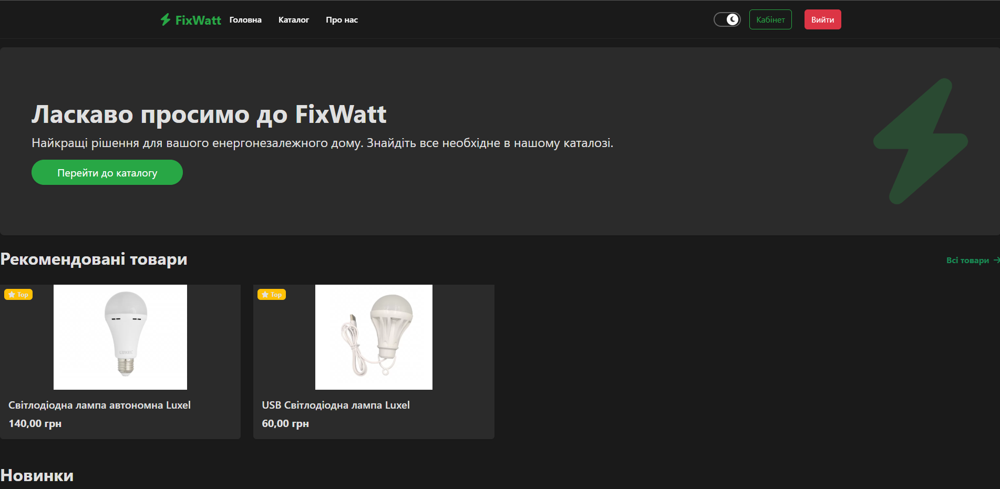
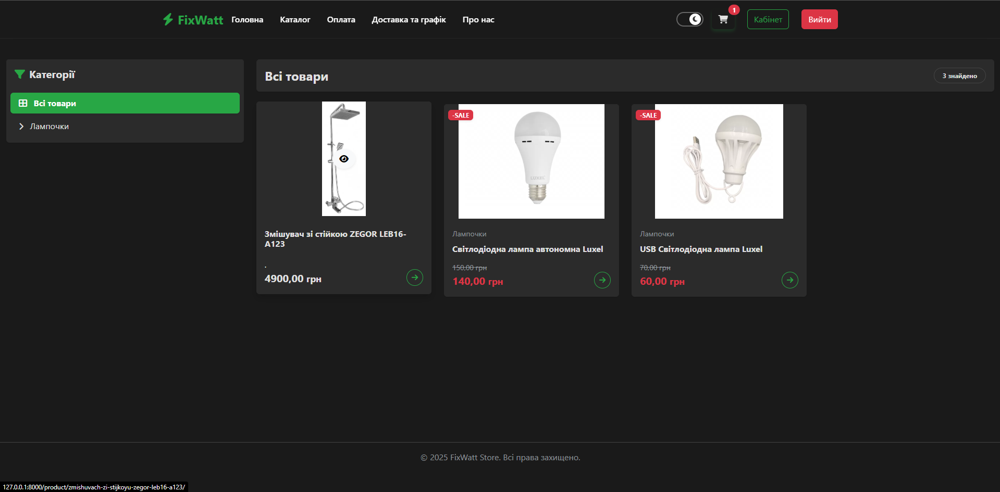

# ⚡ FixWatt – Electronics Store



**FixWatt** – is a modern online electronics and lighting store developed with Django. The project includes a product catalog, shopping cart, checkout process, Nova Poshta integration, and an administrative panel for content management.

## 🚀 Key Features

*   **Product Catalog**: Convenient product browsing with category filtering.
*   **Shopping Cart**: Adding products, changing quantities, automatic total calculation.
*   **Checkout**: Form with data validation and delivery selection.
*   **Personal Cabinet**: Viewing order history and status.
*   **Dark/Light Theme**: Adaptive design with theme switching support.

## 📸 Screenshots

### Home Page


### Product Catalog


### Checkout


### Admin Panel


## 🛠 Technologies

*   **Python 3.9+**
*   **Django 4.2**
*   **PostgreSQL** (Database)
*   **Bootstrap 5** (Frontend)
*   **JavaScript** (AJAX, UI interaction)
*   **Docker** (optional for deployment)

## ⚙️ Installation and Setup

### 1. Clone the repository

```bash
git clone https://github.com/your-username/FixWatt.git
cd FixWatt
```

### 2. Environment Setup

Create a virtual environment and install dependencies:

```bash
python -m venv venv
# Windows
venv\Scripts\activate
# Linux/macOS
source venv/bin/activate

pip install -r requirements.txt
```

### 3. Environment Variables Setup

Create a `.env` file in the project root (next to `manage.py`) and add database and API settings:

```ini
DEBUG=True
SECRET_KEY=your_secret_key_here

# Database Settings (PostgreSQL)
DB_NAME=fixwatt_db
DB_USER=postgres
DB_PASSWORD=your_password
DB_HOST=127.0.0.1
DB_PORT=5432

# Nova Poshta API
NOVA_POSHTA_API_KEY=your_key
NOVA_POSHTA_API_TOKEN=your_token
```

### 4. Database Preparation

Ensure PostgreSQL is running and the `fixwatt_db` database is created.

```bash
python manage.py migrate
python manage.py createsuperuser # To access the admin panel
```

### 5. Running the Server

```bash
python manage.py runserver
```

Open your browser at [http://127.0.0.1:8000](http://127.0.0.1:8000).

---
© 2025 FixWatt Team
